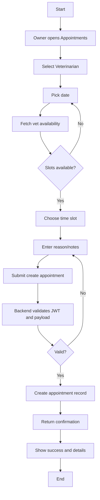

# Activity Diagram — Booking a Vet Appointment

```mermaid
flowchart TD
  A[Start] --> B[Owner opens Appointments]
  B --> C[Select Veterinarian]
  C --> D[Pick date]
  D --> E[Fetch vet availability]
  E --> F{Slots available?}
  F -- No --> D
  F -- Yes --> G[Choose time slot]
  G --> H[Enter reason/notes]
  H --> I[Submit create appointment]
  I --> J[Backend validates JWT and payload]
  J --> K{Valid?}
  K -- No --> H
  K -- Yes --> L[Create appointment record]
  L --> M[Return confirmation]
  M --> N[Show success and details]
  N --> O[End]
```
