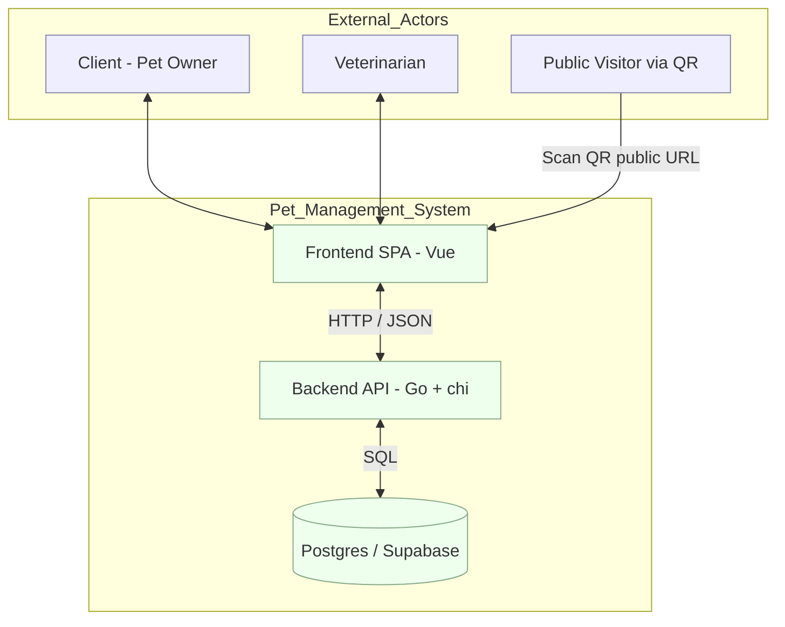

# Context Diagram

The system centers on a REST API with a web SPA and a Postgres database.

```mermaid
flowchart TD
  subgraph External_Actors
    A[Client - Pet Owner]
    B[Veterinarian]
    C[Public Visitor via QR]
  end

  subgraph Pet_Management_System
    S[Frontend SPA - Vue]
    API[Backend API - Go + chi]
    DB[(Postgres / Supabase)]
  end

  A <--> S
  B <--> S
  C -->|Scan QR public URL| S

  S <--> |HTTP / JSON| API
  API <--> |SQL| DB

  classDef external fill:#eef,stroke:#88a,stroke-width:1px;
  classDef system fill:#efe,stroke:#8a8,stroke-width:1px;
  class A,B,C external;
  class S,API,DB system;
```
