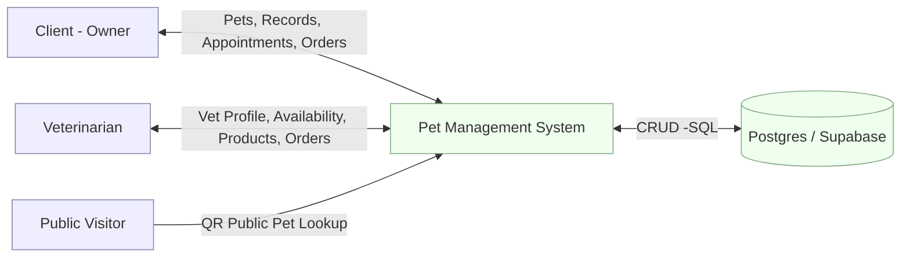

# Data Flow Diagram — Level 0

High-level data movement across the whole system.

```mermaid
graph LR
  A[Client - Owner]
  B[Veterinarian]
  C[Public Visitor]

  P[Pet Management System]
  DB[(Postgres / Supabase)]

  A <--> |Pets, Records, Appointments, Orders| P
  B <--> |Vet Profile, Availability, Products, Orders| P
  C --> |QR Public Pet Lookup| P

  P <--> |CRUD -SQL | DB

  classDef actor fill:#eef,stroke:#88a,stroke-width:1px;
  classDef system fill:#efe,stroke:#8a8,stroke-width:1px;
  class A,B,C actor;
  class P,DB system;
```
