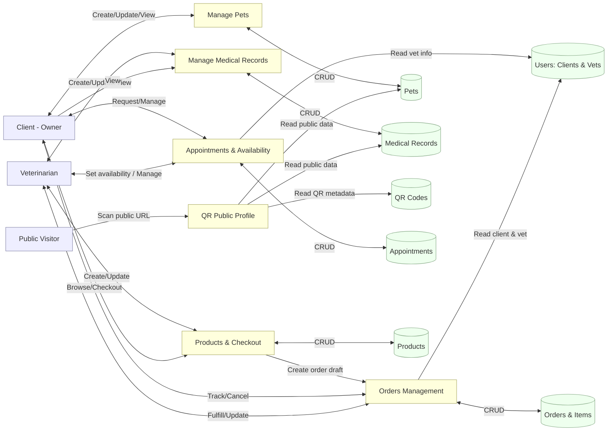

# Data Flow Diagram — Level 1

Drilling into major processes inside the system.

```mermaid
flowchart LR
  %% External Entities
  Owner[Client - Owner]:::ext
  Vet[Veterinarian]:::ext
  Public[Public Visitor]:::ext

  %% Processes
  P1[Manage Pets]:::proc
  P2[Manage Medical Records]:::proc
  P3[QR Public Profile]:::proc
  P4[Appointments & Availability]:::proc
  P5[Products & Checkout]:::proc
  P6[Orders Management]:::proc

  %% Data Stores
  D1[(Pets)]:::store
  D2[(Medical Records)]:::store
  D3[(QR Codes)]:::store
  D4[(Appointments)]:::store
  D5[(Products)]:::store
  D6[(Orders & Items)]:::store
  D7[(Users: Clients & Vets)]:::store

  %% Flows
  Owner <--> |Create/Update/View| P1
  P1 <--> |CRUD| D1

  Vet <--> |Create/Update/View| P2
  Owner --> |View| P2
  P2 <--> |CRUD| D2

  Public --> |Scan public URL| P3
  P3 --> |Read public data| D1
  P3 --> |Read public data| D2
  P3 --> |Read QR metadata| D3

  Owner <--> |Request/Manage| P4
  Vet <--> |Set availability / Manage| P4
  P4 <--> |CRUD| D4
  P4 --> |Read vet info| D7

  Vet <--> |Create/Update| P5
  Owner --> |Browse/Checkout| P5
  P5 <--> |CRUD| D5
  P5 --> |Create order draft| P6

  Owner <--> |Track/Cancel| P6
  Vet <--> |Fulfill/Update| P6
  P6 <--> |CRUD| D6
  P6 --> |Read client & vet| D7

  classDef ext fill:#eef,stroke:#88a,stroke-width:1px;
  classDef proc fill:#ffd,stroke:#aa6,stroke-width:1px;
  classDef store fill:#efe,stroke:#8a8,stroke-width:1px;
```
