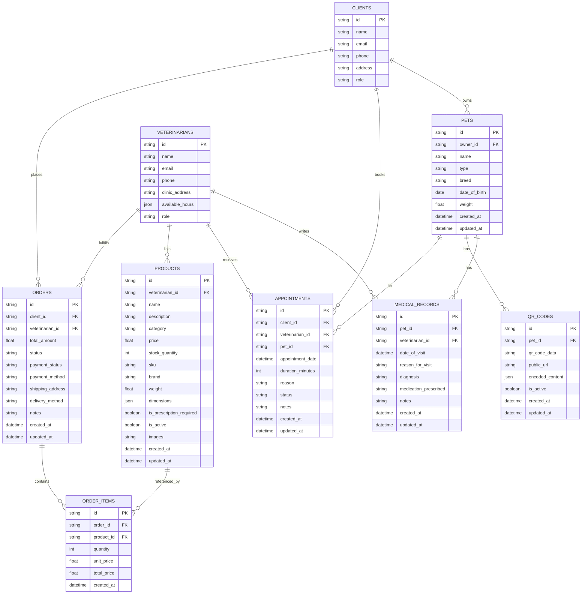

# Entity Relationship Diagram

```mermaid
erDiagram
  CLIENTS ||--o{ PETS : owns
  PETS ||--o{ MEDICAL_RECORDS : has
  VETERINARIANS ||--o{ MEDICAL_RECORDS : writes
  PETS ||--o{ QR_CODES : has

  CLIENTS ||--o{ APPOINTMENTS : books
  VETERINARIANS ||--o{ APPOINTMENTS : receives
  PETS ||--o{ APPOINTMENTS : for

  VETERINARIANS ||--o{ PRODUCTS : lists
  ORDERS ||--o{ ORDER_ITEMS : contains
  CLIENTS ||--o{ ORDERS : places
  VETERINARIANS ||--o{ ORDERS : fulfills
  PRODUCTS ||--o{ ORDER_ITEMS : referenced_by

  CLIENTS {
    string id PK
    string name
    string email
    string phone
    string address
    string role
  }

  VETERINARIANS {
    string id PK
    string name
    string email
    string phone
    string clinic_address
    json available_hours
    string role
  }

  PETS {
    string id PK
    string owner_id FK
    string name
    string type
    string breed
    date date_of_birth
    float weight
    datetime created_at
    datetime updated_at
  }

  MEDICAL_RECORDS {
    string id PK
    string pet_id FK
    string veterinarian_id FK
    datetime date_of_visit
    string reason_for_visit
    string diagnosis
    string medication_prescribed
    string notes
    datetime created_at
    datetime updated_at
  }

  QR_CODES {
    string id PK
    string pet_id FK
    string qr_code_data
    string public_url
    json encoded_content
    boolean is_active
    datetime created_at
    datetime updated_at
  }

  APPOINTMENTS {
    string id PK
    string client_id FK
    string veterinarian_id FK
    string pet_id FK
    datetime appointment_date
    int duration_minutes
    string reason
    string status
    string notes
    datetime created_at
    datetime updated_at
  }

  PRODUCTS {
    string id PK
    string veterinarian_id FK
    string name
    string description
    string category
    float price
    int stock_quantity
    string sku
    string brand
    float weight
    json dimensions
    boolean is_prescription_required
    boolean is_active
    string images
    datetime created_at
    datetime updated_at
  }

  ORDERS {
    string id PK
    string client_id FK
    string veterinarian_id FK
    float total_amount
    string status
    string payment_status
    string payment_method
    string shipping_address
    string delivery_method
    string notes
    datetime created_at
    datetime updated_at
  }

  ORDER_ITEMS {
    string id PK
    string order_id FK
    string product_id FK
    int quantity
    float unit_price
    float total_price
    datetime created_at
  }
```
